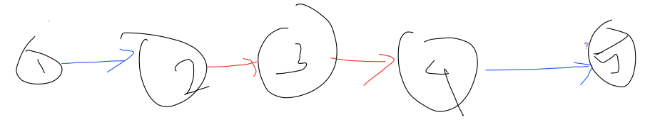

[Home](../../../index.md) \|
[Chapter 1](../../../parts/chapter1.md) \| [**It should be removed. We can link to project home, and chapter 1**]
View @[GitHub Pages ](https://klmahmood.github.io/hello-world/src/chapter1/chapter2/12060.html)\|
## [UVa 12060 - All Integer Average](http://uva.onlinejudge.org/external/120/12060.pdf)

**Source Code:** [C++11](12060_all_integer_average.cpp) \| [C++](12060_all_integer_average.cpp) \ | [Java](12060_all_integer_average.cpp)


<!--
<a href="12060_all_integer_average.cpp" <download="">Download</a>
-->

**Description**

It is a time waster problem. The following graph explains the issues.



**Code Snippet**
```cpp

```

```Java

```
Can't see the code! View @[GitHub Pages](https://klmahmood.github.io/hello-world/src/chapter1/chapter2/12060.html)
<!--
Notes for Me:
Formatted.
Cross-platform
Tested.
-->
